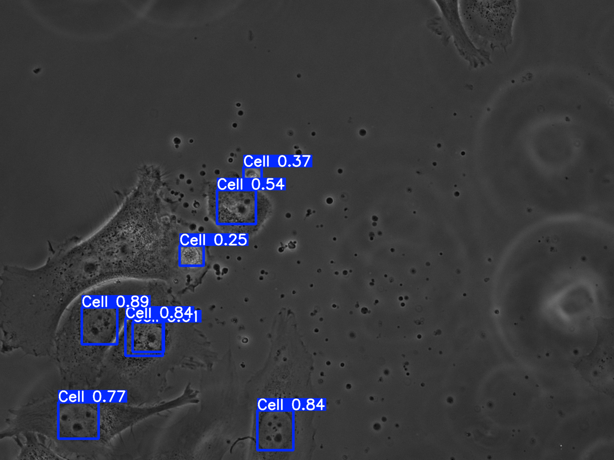

# Cell Nucleus Detection & Tracking

**Master 2 project — Deep Learning for Imaging, 2024-2025**  
Université de Lille × Centrale Lille

---

## What is this project about?

We had to work on cell tracking to evaluate the effectiveness of cancer treatments, as researchers follow how cell nuclei move over time to  study the impact of a drug on them.

The problem is that the usual method — staining cells with blue dye — damages the DNA and biases the results. So instead, we need to work with phase-contrast microscopy images, which are non-invasive but challenging to work with (the images can be noisy and hard to interpret).

The goal was to build a pipeline that automatically detects and tracks cell nuclei in those images using deep learning.

---

## Pipeline

```
Phase-contrast images
        ↓
  Manual annotation with Label Studio
        ↓
  YOLOv8 fine-tuning → cell nucleus detection
        ↓
  Bounding boxes → pixel centre points (cx, cy)
        ↓
  Trackpy:  nucleus tracking across frames
        ↓
  MSD analysis
```

---

## Annotation

I manually annotated **20 images** using [Label Studio](https://labelstud.io/) with the **[Image Object Detection](https://labelstud.io/templates/image_bbox.html)** template (standard bounding boxes). The export is in **YOLO format** — one `.txt` label file per image with normalized coordinates.

Single class: `Cell`

```yaml
# data.yaml
path: ./data/annotated
train: images
val: images
nc: 1
names: ['Cell']

```


---

## Segmentation result example

Here's an example of what the detection looks like on a phase-contrast image:



The model detects most nuclei correctly. Some are missed, mainly because of the small training dataset (20 training images),but the results are promising for a first attempt.

---

## Results

After running the full pipeline:

- **7 main trajectories** were identified (filtered down from 92 raw ones)
- Nucleus lifetimes ranged from **15 to 37 frames**
- MSD was computed per nucleus and as an ensemble average to study motion patterns

---

## How to run it

```bash
git clone https://github.com/YOUR_USERNAME/cell_tracking.git
cd cell_tracking
pip install ultralytics trackpy pandas numpy matplotlib seaborn opencv-python
jupyter notebook notebooks/Pipeline.ipynb
```

---

## Tools used


- [YOLOv8](https://github.com/ultralytics/ultralytics): Cell nucleus detection (segmentation) 
- [Label Studio](https://labelstud.io/): Manual image annotation (training dataset preparation)
- [Trackpy](http://soft-matter.github.io/trackpy/): Linking detected nuclei across frames + filtering

---

## Limitations & next steps

The main limitation is the dataset size — 20 annotated images is not enough for robust detection. A bigger dataset would make a real difference. For the tracking part, Trackpy worked well but it was originally built for fluorescence images, so there's room to test tools more suited to phase-contrast like [TrackMate](https://imagej.net/plugins/trackmate/).

As a next step, comparing MSD curves before and after drug treatment would be the actual way to evaluate treatment effectiveness with this pipeline.

---

**Mouna Jegham** — M2 MIAS, Université de Lille × Centrale Lille, 2024-2025
